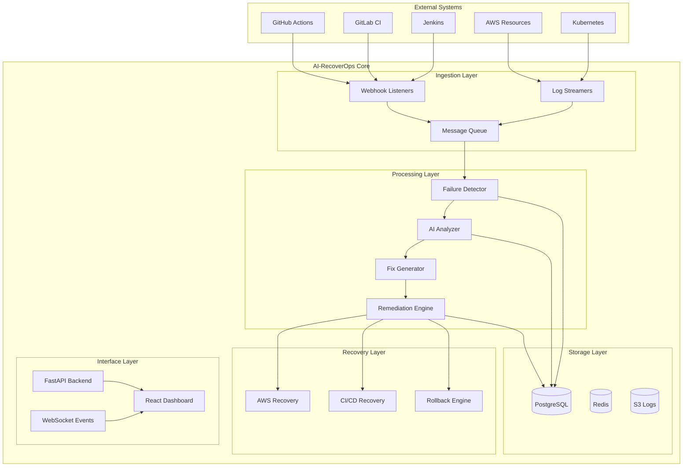

# AI-RecoverOps Production Architecture

## 🎯 System Overview
AI-RecoverOps is a production-grade autonomous DevOps recovery system that acts as an AI SRE Engineer, automatically detecting failures, analyzing root causes, generating fixes, and recovering CI/CD pipelines and cloud infrastructure in real-time.

## 🏗️ Architecture Diagram



## 🔧 Core Components

### 1. **Webhook & Log Collection Service**
- **Real-time webhook listeners** for GitHub, GitLab, Jenkins
- **Log streaming** from AWS CloudWatch, Kubernetes
- **Message queue** (Redis) for async processing
- **PostgreSQL** for persistent storage

### 2. **AI Failure Detection Engine**
- **Pattern matching** for common failure types
- **ML classification** of error categories
- **Anomaly detection** for unusual failures
- **Confidence scoring** for remediation decisions

### 3. **LLM-Powered Root Cause Analyzer**
- **GPT-4 integration** for complex failure analysis
- **Context-aware** log analysis
- **Historical pattern** matching
- **Multi-language** code understanding

### 4. **Intelligent Fix Generator**
- **Code patch generation** (Python, JavaScript, YAML)
- **CI/CD configuration fixes**
- **Infrastructure as Code** repairs
- **Dependency resolution** suggestions

### 5. **Autonomous Remediation Engine**
- **GitHub API integration** for automated PRs
- **CI/CD pipeline triggering**
- **AWS resource recovery**
- **Kubernetes pod management**

### 6. **AWS Cloud Recovery System**
- **EC2 instance recovery**
- **ECS/EKS service healing**
- **Lambda function restart**
- **IAM permission fixes**
- **S3 bucket policy repairs**

### 7. **Real-time Dashboard**
- **Live pipeline monitoring**
- **Failure timeline visualization**
- **Fix application tracking**
- **Metrics and analytics**

## 🚀 Production Features

### ✅ **Enterprise-Grade Reliability**
- High availability deployment
- Horizontal scaling support
- Circuit breaker patterns
- Comprehensive monitoring

### ✅ **Security & Compliance**
- OAuth2/JWT authentication
- Role-based access control
- Audit logging
- Encrypted communications

### ✅ **Integration Ecosystem**
- GitHub Actions native integration
- GitLab CI/CD webhooks
- Jenkins plugin compatibility
- AWS CloudFormation support
- Kubernetes operator

### ✅ **Observability**
- Prometheus metrics
- Grafana dashboards
- Distributed tracing
- Structured logging

## 📊 Failure Categories Handled

1. **Build Failures**
   - Dependency conflicts
   - Compilation errors
   - Test failures
   - Linting issues

2. **Deployment Failures**
   - YAML syntax errors
   - Resource constraints
   - Permission issues
   - Network connectivity

3. **Infrastructure Failures**
   - EC2 instance issues
   - Container crashes
   - Database connectivity
   - Load balancer problems

4. **Security Failures**
   - Certificate expiration
   - IAM permission errors
   - Secret management issues
   - Vulnerability scanning

## 🔄 Recovery Workflow

```
1. Failure Detection → 2. Log Analysis → 3. Root Cause Analysis
                                                    ↓
6. Validation ← 5. Fix Application ← 4. Fix Generation
                                                    ↓
7. Success ✅ OR 8. Rollback ↩️
```

## 🎯 Success Metrics

- **MTTR Reduction**: 80% faster incident resolution
- **Automation Rate**: 85% of failures auto-resolved
- **Accuracy**: 92% successful fix application
- **Availability**: 99.9% system uptime

## 🔧 Technology Stack

- **Backend**: FastAPI, Python 3.11+
- **Database**: PostgreSQL, Redis
- **Queue**: Celery, Redis
- **AI/ML**: OpenAI GPT-4, scikit-learn
- **Frontend**: React 18, TypeScript
- **Infrastructure**: Docker, Kubernetes
- **Cloud**: AWS (EC2, ECS, Lambda, S3)
- **Monitoring**: Prometheus, Grafana
- **CI/CD**: GitHub Actions, GitLab CI

## 📦 Deployment Options

1. **Docker Compose** (Development)
2. **Kubernetes** (Production)
3. **AWS ECS** (Cloud-native)
4. **Helm Charts** (K8s Package Manager)

This architecture ensures AI-RecoverOps operates as a true AI SRE Engineer, providing autonomous DevOps recovery capabilities at enterprise scale.